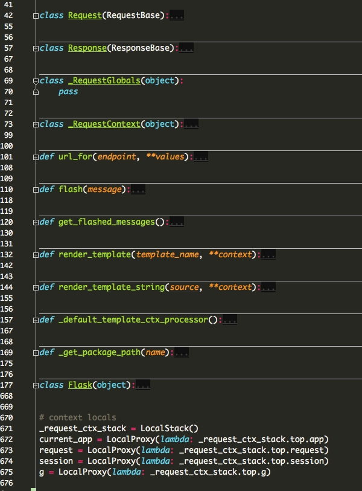
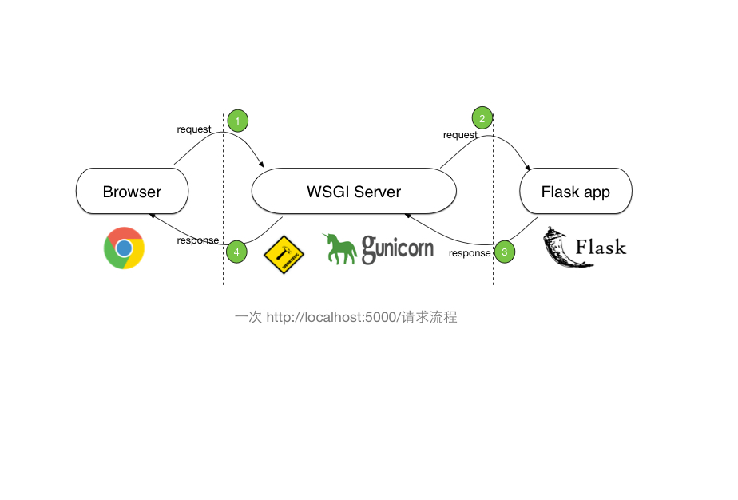

### 阅读笔记—— release 0.1

#### 🐍 一、前言

阅读开源项目源代码也是有套路的，有人会直接从Github上 fork或者clone一个开源项目，然后就开始阅读。这是不科学的。

一个项目不是一口气写完的，而是作者经过很多次迭代打磨，甚至还有很多其他开源贡献者共同的一次次commit成就的。而最佳的入门方式，应该是从项目的最早的一个release版本开始着手阅读。

因为：
1. 代码量最少，文件量最少，便于立即着手阅读，而不是花费半天时间去立即每一个模块，文件的依赖关系；
2. 此时的代码是核心代码。项目迭代过程会加上很多容错、兼容、健壮性代码，但是这些代码并不是项目的核心代码，而是优化代码。
3. 便于立即跑通代码。

基于以上三个原因。我们开启Flask的源码阅读之路。

#### 🐍 二、环境准备

Flask的最早release版本是 0.1，Python解释器是2.X版本，所以最好是用virtualenv来新建一个虚拟环境。另外，Flask还依赖Werkzeug和Jinja2两个包，
并且这两个包发展到目前也已经迭代了很多版本，如果是0.1版本的Flask，应该是需要恢复到当时的Werkzeug和Jinja2版本。所以，环境准备的目的是为了尽量恢复到
0.1版本开发时候的环境，排除其他干扰。

首先 checkout 0.1 版本

git checkout 0.1

为了不破坏"犯罪现场"，我们立即从0.1版本再次checkout一个新的版本，我把它命名为 `source_code_reading_0.1`

到此时，依赖的Werkzeug和Jinja2两个包还没有安装好，可以在项目的根目录下看到有一个名为 setup.py的文件，里面有依赖的Werkzeug和Jinja2两个包的版本号（注意里面的依赖是 >=, 需要改成 == 号，才会安装对应的低版本号，如果不这样做，）。
运行命令 python setup.py install

现在，已经到了一个全新的 0.1版本分支了，在这个分支上，我们可以随意注释、更改、调试，最后commit代码。


#### 🐍 三、项目结构说明

0.1版本的Flask项目结构(布局)很简洁，flask的核心代码全部在flask.py单个模块中（后面的Flask版本flask.py被慢慢抽象成了一个包，里面包含很多不同的模块文件）

下面的项目的结构

```
flask
    ├── LICENSE
    ├── Makefile
    ├── README
    ├── artwork
    ├── docs
    ├── examples
    ├── flask.py
    ├── setup.py
    ├── tests
    └── website
```

1. LICENSE 文件
2. Makefile文件（我很少用）
3. README (文件没有后缀，为了更好的编辑这个文件，建议更改成.md文件)
4. artwork 是一个目录，里面放的是Flask的logo图片文件
5. docs 是一个目录，里面是Flask的文档
6. examples 一个目录，里面是用Flask做的两个demo小项目，适合入门学习Flask
7. flask.py Flaks的核心代码全部在这一个文件里
8. setup.py
9. tests 测试用例目录
10. website Flask官网静态文件目录


#### flask.py 代码结构宏观看



整个flask.py文件的代码结构如上图所示，可以看到整个文件只有600+行代码，而且其中估计60%都是注释行。其中核心代码是 Flask类的定义 以及 最后的5行代码。

另外 flask.py文件中也定义了 `Request`类和`Response`类，他们分别继承了 werkzeug 中 `RequestBase`和`ResponseBase`类，werkzeug这两个类已经帮我们做了几乎全部的Request及Response封装

`_RequestContext`类也是一个非常非常重要的类，下面会讲到这个类。

#### 理解 Request Context

```
# context locals
_request_ctx_stack = LocalStack()
current_app = LocalProxy(lambda: _request_ctx_stack.top.app)
request = LocalProxy(lambda: _request_ctx_stack.top.request)
session = LocalProxy(lambda: _request_ctx_stack.top.session)
g = LocalProxy(lambda: _request_ctx_stack.top.g)
```


在0.5及以后移动到了 flask/globals.py 中。

LocalStack和LocalProxy都离不开Local。Local实现了访问全局对象而实际去拿特定线程local对象的功能。
首先Local通过thread.get_ident（如果是greenlet则为greenlet.get_ident）来拿到一个线程id，这个线程id是一个非负整数，它的值没有什么实际的意义，
但能标识出是在不同的线程之中。看Local.__getattr__的实现，实际取的值为 self.__storage__[get_ident()](name)，self.__storage__是一个实例自带的dict，__setattr__和__delattr__也同理。

代码示例

```
>>> local = Local()

# 在线程1中
>>> local.name = 'Alice'

# 在线程2中
>>> local.name = 'Bob'
```

所得到的效果就是我们全局给local.name赋了值，但在不同的线程中，取值时local.name其实是不同的。

但_request_ctx_stack是一个LocalStack，什么是LocalStack呢，看名字就能想到它是一个基于Local而衍生出来的Stack，
内部存储实际就是一个python的list，它实现了push/pop方法，以及top来取栈顶元素，而且也能像Local一样，不同的线程能解析出不同的Stack。

```
>>> ls = LocalStack()
>>> ls.push(42)
>>> ls.top
42
>>> ls.push(23)
>>> ls.top
23
>>> ls.pop()
23
>>> ls.top
42
```

但flask没有直接用Local，而是用了LocalProxy，对一个LocalProxy对象的操作，实际上都指向了它所代理的local对象（`LocalProxy._get_current_object` 方法获得）。用LocalProxy方便了Local的管理，只用实例化一个Local对象，而不用实例化很多个，通过不同的LocalProxy来访问同一个Local的不同属性。

`_RequestContext` 实现了一个context，在enter的时候，也就是request的开始，会向 `_request_ctx_stack.push(self)`，exit的时候，也就是request结束时，pop出。`_RequestContext` 定义了一些属性，如 `app/url_adapter/request/session/g` 。通过stack的机制，当在请求的上下文中，全局的 `request/g/session/current_app` 总能拿到栈顶元素的相应属性。

在werkzeug.locals的代码中加上一些print语句:

以下是对一次 在浏览器中 访问 `http://127.0.0.1:5000/`的输出日志

```
 * Running on http://127.0.0.1:5000/
get_ident(): 140735835550656, name: stack
get_ident(): 140735835550656, name: stack
push: <flask._RequestContext object at 0x10d780090> to stack, after: [<flask._RequestContext object at 0x10d780090>]
get_ident(): 140735835550656, name: stack
get_ident(): 140735835550656, name: stack
_get_current_object called: <Request 'http://127.0.0.1:5000/' [GET]>
get_ident(): 140735835550656, name: stack
get_ident(): 140735835550656, name: stack
_get_current_object called: <Request 'http://127.0.0.1:5000/' [GET]>
get_ident(): 140735835550656, name: stack
get_ident(): 140735835550656, name: stack
get_ident(): 140735835550656, name: stack
get_ident(): 140735835550656, name: stack
pop from stack current [<flask._RequestContext object at 0x10d780090>]
127.0.0.1 - - [22/Oct/2017 23:13:16] "GET / HTTP/1.1" 200 -
```

为了更好的理解Flask的源码，我们先来了解一下http://127.0.0.1:5000访问，背后发生了什么。下面的图是对这个过程的一个粗糙描述。



我们在项目的根目录下新建文件 `run.py`，在其中写如下代码，并执行，此时将会开启一个wsgi server（又werkgeug实现）

```python
from flask import Flask

app = Flask(__name__)

if __name__ == '__main__':
    app.run()
    
```
当我们在浏览器的地址栏中输入 `http://localhost:5000` 访问后，浏览器将发起一个 request，如图中 ① 所示。

wsgi server 收到浏览器的 request请求后，会对其进行一定的解析和加强后，再调用 flask的 app， 如图中 ② 所示。

那么重点来了，wsgi server 是如何调用 flask app的呢？通过阅读 Flask 类的定义，我们发现它实现了一个 `__call__` 函数，这个函数会在调用 app的时候 自动执行, 例如 `app()`

```python

def __call__(self, environ, start_response):
    """Shortcut for :attr:`wsgi_app`"""
    return self.wsgi_app(environ, start_response)
        
        
def wsgi_app(self, environ, start_response):
    """The actual WSGI application.  This is not implemented in
    `__call__` so that middlewares can be applied:

        app.wsgi_app = MyMiddleware(app.wsgi_app)

    :param environ: a WSGI environment
    :param start_response: a callable accepting a status code,
                           a list of headers and an optional
                           exception context to start the response
    """
    with self.request_context(environ): 
        rv = self.preprocess_request()
        if rv is None:
            rv = self.dispatch_request()
        response = self.make_response(rv)
        response = self.process_response(response)
        return response(environ, start_response)
```

也就是说 wsgi server中 在某一个地方一定执行了 `app()`这样一条语句。`__call__`函数有两个参数，一个是 `environ`和`start_response`, 
environ 是environment的缩写，表示的是request请求的上下文，例如请求的资源路径、http headers等数据，我们可以在`__call__`中print一下 environ，结果如下。

> {'wsgi.multiprocess': False, 'HTTP_COOKIE': 'remember_token=spacebox|8f685a538ac321a3073f46595c40a3eb731d931a40dec703c0895ecb94c9d1c857e4f009b2059aa7ab31c93051e85e94e2be76264cbec6ee2ca4bbfe44e61c81; session=.eJw9zksKwkAQRdG99DiD6kp_sxmpz2t0YiQxIIh7NyA4PZN73-EyNuzXsDy3A1O43DwsQWofjGo1MxfOPfpwNULtTtQKW8opuqLNKgaD0EiKXIpV1YYccwE7m2svbkNUAemWuHFqowHZWbQ5lZRmjJgiDaFooJjnXkuYgpitx_15zuyPs6Hr68Rjx_Y7_OPnCw0DOtc.DNA_mg.jo6cex9OJ8Vp29H2edWSJn35pbo', 'SERVER_SOFTWARE': 'Werkzeug/0.6.1', 'SCRIPT_NAME': '', 'REQUEST_METHOD': 'GET', 'PATH_INFO': '/', 'SERVER_PROTOCOL': 'HTTP/1.1', 'QUERY_STRING': '', 'CONTENT_LENGTH': '', 'HTTP_USER_AGENT': 'Mozilla/5.0 (Macintosh; Intel Mac OS X 10_10_4) AppleWebKit/537.36 (KHTML, like Gecko) Chrome/61.0.3163.100 Safari/537.36', 'HTTP_CONNECTION': 'keep-alive', 'SERVER_NAME': '127.0.0.1', 'REMOTE_PORT': 64102, 'HTTP_ALEXATOOLBAR_ALX_NS_PH': 'AlexaToolbar/alx-4.0', 'wsgi.url_scheme': 'http', 'SERVER_PORT': '5000', 'wsgi.input': <socket._fileobject object at 0x110d13d50>, 'HTTP_HOST': '127.0.0.1:5000', 'wsgi.multithread': False, 'HTTP_UPGRADE_INSECURE_REQUESTS': '1', 'HTTP_ACCEPT': 'text/html,application/xhtml+xml,application/xml;q=0.9,image/webp,image/apng,*/*;q=0.8', 'wsgi.version': (1, 0), 'wsgi.run_once': False, 'wsgi.errors': <open file '<stderr>', mode 'w' at 0x1100e01e0>, 'REMOTE_ADDR': '127.0.0.1', 'HTTP_ACCEPT_LANGUAGE': 'zh-CN,zh;q=0.8,en-US;q=0.6,en;q=0.4', 'CONTENT_TYPE': '', 'HTTP_ACCEPT_ENCODING': 'gzip, deflate, br'}


#### LocalProxy 类的__init__方法
```
 def __init__(self, local, name=None):
        object.__setattr__(self, '_LocalProxy__local', local)
        object.__setattr__(self, '__name__', name)
```

这个地方为何是用`object.__setattr__`而不是用`self.name = name`的方式

This method is called instead of the normal mechanism (i.e. store the value in the instance dictionary).

If __setattr__() wants to assign to an instance attribute, it should not simply execute self.name = value — this would cause a recursive call to itself.

Instead, it should insert the value in the dictionary of instance attributes, e.g., self.__dict__[name] = value.

For new-style classes, rather than accessing the instance dictionary, it should call the base class method with the same name, for example,

>>> object.__setattr__(self, name, value).


ref:

https://github.com/pallets/werkzeug/blob/0.6.1/werkzeug/local.py

https://github.com/pallets/flask/blob/0.1/flask.py

https://stackoverflow.com/a/38945407/995394
